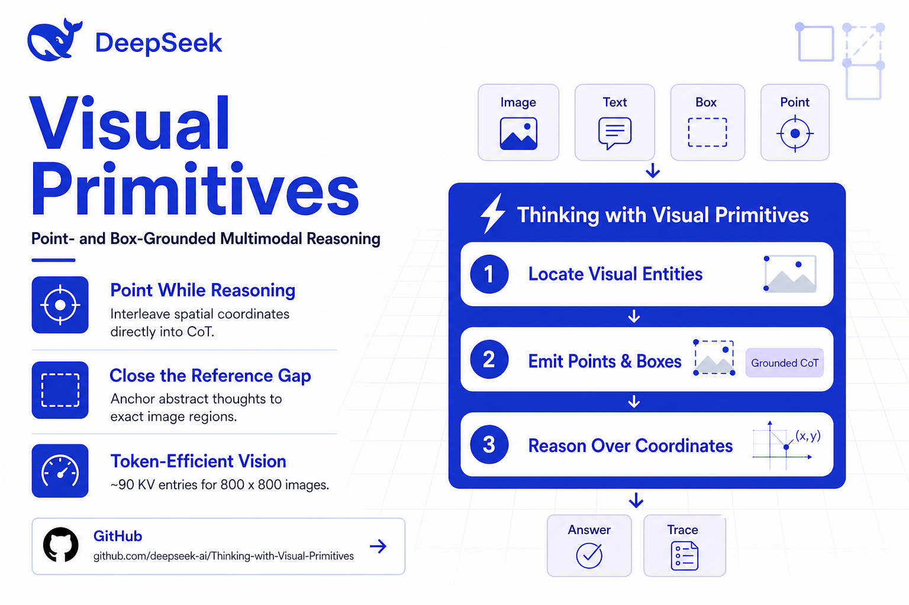
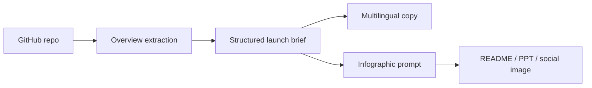

# QuickFork

QuickFork helps a GitHub project become understandable, visible, and easy to share.

It turns repository context into a fast project overview, native launch copy, and platform-ready infographic prompts for GitHub README files, slide decks, and social media.

Repository: https://github.com/moose-lab/QuickFork



## Why QuickFork Exists

Good open source projects often hide their best ideas inside README files, papers, benchmark tables, and implementation details. QuickFork compresses that context into a distribution-ready package:

- a clear project overview
- aligned English, Chinese, and Japanese launch copy
- infographic prompts with fixed visual structure and source-backed brand or GitHub account identity assets
- image size presets for README, PPT, and social platforms
- model settings surfaced in the app and secrets documented separately

The goal is not only to understand a project quickly. The goal is to help the project get seen, explained, and spread.

## Current Web App

The app is a functional first screen built with React and TypeScript.

It includes:

- GitHub repository input
- project name input
- technical notes / README / paper summary input
- narrative options for research, performance, and developer adoption stories
- model settings for copy and image generation
- output size presets for GitHub README, PowerPoint, X/LinkedIn, and square social posts
- multilingual copy preview
- infographic prompt preview
- Brand logo / GitHub account avatar rule to avoid random generated logos
- example materials from the original FlashQLA / Thinking with Visual Primitives workflow

## Workflow



## Output Presets

| Preset | Size | Aspect | Purpose |
| --- | ---: | ---: | --- |
| GitHub README | `1536x1024` | `3:2` | Repository landing visuals |
| PowerPoint 16:9 | `1920x1080` | `16:9` | Slide decks and talks |
| X / LinkedIn landscape | `1600x900` | `16:9` | Social distribution |
| Square social | `1200x1200` | `1:1` | Compact platform previews |

## Tech Stack

- Vite
- React
- TypeScript
- Node.js tooling
- Vitest
- Testing Library
- lucide-react
- Better Auth
- Neon Postgres
- Drizzle ORM

## Project Structure

```text
src/
  App.tsx                 Web app shell and product interface
  main.tsx                React entry point
  components/auth/        Sign-in, sign-up, and user state controls
  core/
    pipeline.ts           Repo parsing, presets, settings, launch package generation
    pipeline.test.ts      Core workflow tests
  server/
    auth.ts               Better Auth configuration
    db/                   Neon Drizzle client and auth schema
  styles/
    app.css               Responsive product UI
api/
  auth/[...all].ts        Vercel Function mounted at /api/auth/*
drizzle/
  *.sql                   Database migrations
public/
  examples/               Reference and generated cover images
docs/
  plans/                  Implementation notes
drizzle.config.ts         Drizzle migration config
vercel.json               Vercel deployment config
.github/workflows/ci.yml  CI/CD workflow for tests, build, and Vercel production deploys
```

## Model Settings

Model names and generation settings are visible in the UI so a user can decide how each asset should be made.

Defaults:

```env
VITE_DEFAULT_COPY_MODEL=gpt-5.5
VITE_DEFAULT_IMAGE_MODEL=gpt-image-2
VITE_DEFAULT_IMAGE_QUALITY=high
```

Secrets belong on the server, not in browser code:

```env
OPENAI_API_KEY=
DATABASE_URL=
BETTER_AUTH_SECRET=
BETTER_AUTH_URL=
BETTER_AUTH_TRUSTED_ORIGINS=
GOOGLE_CLIENT_ID=
GOOGLE_CLIENT_SECRET=
RESEND_API_KEY=
AUTH_EMAIL_FROM=
```

## Authentication

QuickFork uses Better Auth with Neon Postgres and Drizzle.

- `/sign-up` creates or verifies an account through email OTP.
- `/sign-in` signs users in with email OTP or Google.
- `/api/auth/*` is handled by a Vercel Function.
- The top navigation shows sign-in/sign-up links when signed out and user identity controls when signed in.

Database setup:

```bash
npm run db:generate
npm run db:migrate
```

Google OAuth redirect URLs should include:

```text
http://localhost:5173/api/auth/callback/google
https://your-domain.example/api/auth/callback/google
```

For live generation, add a Node API layer or Vercel serverless route that:

1. fetches GitHub README / metadata / optional PDF context
2. calls the copy model
3. calls the image model
4. stores a manifest with copy, prompt, image path, model settings, and output preset

The current app keeps the core workflow deterministic and client-safe.

## Local Development

```bash
npm install
npm run dev
```

Use `npm run dev:vercel` when testing auth locally because `/api/auth/*` is served by Vercel Functions.

## Verification

```bash
npm test
npm run build
```

## Deployment Automation

GitHub Actions runs the full CI/CD workflow in `.github/workflows/ci.yml`.

- Pull requests to `main` run install, tests, and production build.
- Pushes to `main` run the same verification first, then deploy to Vercel production with prebuilt artifacts.
- Manual runs are available from the GitHub Actions `workflow_dispatch` button.
- Vercel native Git auto-deployments are disabled in `vercel.json` so this workflow is the single production deployment path.

Required GitHub repository secrets:

```env
VERCEL_TOKEN=
VERCEL_ORG_ID=
VERCEL_PROJECT_ID=
```

`VERCEL_ORG_ID` and `VERCEL_PROJECT_ID` come from `.vercel/project.json`. Create `VERCEL_TOKEN` in Vercel account settings and store it only as a GitHub Actions secret.

## Roadmap

- Fetch GitHub README and repository metadata automatically.
- Add PDF upload and extraction for paper-style repositories.
- Add server-side OpenAI generation using `OPENAI_API_KEY`.
- Save generation manifests for repeatable publishing.
- Export README banners, slide images, and social cards as separate assets.
- Add project pages for public showcases.

## License

MIT. Check source and generated asset rights before using example images in public distribution.
