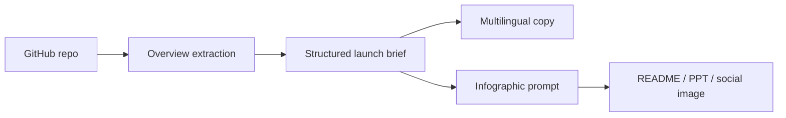

# QuickFork

QuickFork helps a GitHub project become understandable, visible, and easy to share.

It turns repository context into a fast project overview, native launch copy, and platform-ready infographic prompts for GitHub README files, slide decks, and social media.

Repository: https://github.com/moose-lab/QuickFork

[](https://vercel.com/new/clone?repository-url=https%3A%2F%2Fgithub.com%2Fmoose-lab%2FQuickFork&project-name=quickfork&repository-name=QuickFork)


## Why QuickFork Exists

Good open source projects often hide their best ideas inside README files, papers, benchmark tables, and implementation details. QuickFork compresses that context into a distribution-ready package:

- a clear project overview
- aligned English, Chinese, and Japanese launch copy
- infographic prompts with fixed visual structure
- image size presets for README, PPT, and social platforms
- model settings surfaced in the app and secrets documented separately

The goal is not only to understand a project quickly. The goal is to help the project get seen, explained, and spread.

## Current Web App

The app is a functional first screen built with React and TypeScript.

It includes:

- GitHub repository input
- project name input
- technical notes / README / paper summary input
- narrative options for research, performance, and developer adoption stories
- model settings for copy and image generation
- output size presets for GitHub README, PowerPoint, X/LinkedIn, and square social posts
- multilingual copy preview
- infographic prompt preview
- example materials from the original FlashQLA / Thinking with Visual Primitives workflow

## Workflow



## Output Presets

| Preset | Size | Aspect | Purpose |
| --- | ---: | ---: | --- |
| GitHub README | `1536x1024` | `3:2` | Repository landing visuals |
| PowerPoint 16:9 | `1920x1080` | `16:9` | Slide decks and talks |
| X / LinkedIn landscape | `1600x900` | `16:9` | Social distribution |
| Square social | `1200x1200` | `1:1` | Compact platform previews |

## Tech Stack

- Vite
- React
- TypeScript
- Node.js tooling
- Vitest
- Testing Library
- lucide-react
- Vercel-ready static deployment

## Project Structure

```text
src/
  App.tsx                 Web app shell and product interface
  main.tsx                React entry point
  core/
    pipeline.ts           Repo parsing, presets, settings, launch package generation
    pipeline.test.ts      Core workflow tests
  styles/
    app.css               Responsive product UI
public/
  examples/               Reference and generated cover images
docs/
  plans/                  Implementation notes
vercel.json               Vercel deployment config
.github/workflows/ci.yml  Test and build workflow
```

## Model Settings

Model names and generation settings are visible in the UI so a user can decide how each asset should be made.

Defaults:

```env
VITE_DEFAULT_COPY_MODEL=gpt-5.5
VITE_DEFAULT_IMAGE_MODEL=gpt-image-2
VITE_DEFAULT_IMAGE_QUALITY=high
```

Secrets belong on the server, not in browser code:

```env
OPENAI_API_KEY=
```

For live generation, add a Node API layer or Vercel serverless route that:

1. fetches GitHub README / metadata / optional PDF context
2. calls the copy model
3. calls the image model
4. stores a manifest with copy, prompt, image path, model settings, and output preset

The current app keeps the core workflow deterministic and client-safe.

## Local Development

```bash
npm install
npm run dev
```

## Verification

```bash
npm test
npm run build
```

## Vercel Deployment

QuickFork is ready for Vercel.

Fast path:

1. Click the **Deploy with Vercel** button at the top of this README.
2. Import `moose-lab/QuickFork`.
3. Keep the default Vite settings.
4. Deploy.

Recommended Vercel settings:

- Framework Preset: `Vite`
- Install Command: `npm install`
- Build Command: `npm run build`
- Output Directory: `dist`

The same settings are captured in `vercel.json`.

## Roadmap

- Fetch GitHub README and repository metadata automatically.
- Add PDF upload and extraction for paper-style repositories.
- Add server-side OpenAI generation using `OPENAI_API_KEY`.
- Save generation manifests for repeatable publishing.
- Export README banners, slide images, and social cards as separate assets.
- Add project pages for public showcases.

## License

MIT. Check source and generated asset rights before using example images in public distribution.
