# SeekersAI.com Landing Site Architecture Plan

Date: 2026-06-04
Scope: QuickFork public landing site at `https://seekersai.com`
Skill basis: `site-architecture`

## Planning Summary

QuickFork is a hybrid SaaS and content-led launch site. It is no longer only a homepage landing page: the current public crawl surface already includes product-intent pages, use-case pages, resources, a free tool, a template, examples, comparison pages, support/legal pages, `llms.txt`, and `pricing.md`.

The architecture goal is to keep the homepage as the conversion and product-studio hub, while making the published growth pages discoverable through clear navigation, hub-and-spoke internal links, and stable URL patterns.

### Business Context

- Product: QuickFork turns a GitHub repository into a launch-ready story and shareable marketing asset package.
- Primary audience: open-source maintainers, AI project builders, DevRel teams, founders, product marketers, and design leads.
- Primary conversion: paste a GitHub repository URL and generate a free repo brief or launch package.
- Secondary conversions: sign up, inspect examples, request a checklist/template, request a full launch package, or contact the team.
- Evidence constraint: pages must avoid invented metrics, customer logos, pricing claims, or proof points that are not backed by repository evidence or explicit user input.

### Current State

- Site type: existing hybrid SaaS plus content/growth site.
- Current canonical production domain: `https://seekersai.com`.
- Current live checks on 2026-06-04: `/`, `/sitemap.xml`, and `/llms.txt` return HTTP 200 from Vercel.
- Existing source of truth for crawlable marketing URLs: `src/marketing/link-catalog.ts`.
- Existing sitemap output: `public/sitemap.xml`.
- Existing homepage navigation: Product dropdown to page anchors, Pricing anchor, sign-in/sign-up through `UserMenu`.
- Existing footer navigation: Contact, Help, Privacy, Terms.
- Existing page-level internal linking: `MarketingPage` renders up to 3 related routes based on funnel stage or buyer stage.

### Architecture Gaps

- Header navigation does not expose published growth page clusters such as use cases, resources, tools, examples, or comparisons.
- Footer does not expose the current product, resource, example, compare, `llms.txt`, or `pricing.md` crawl surfaces.
- Parent cluster URLs such as `/product`, `/resources`, `/examples`, and `/compare` are conceptual in the URL structure but do not currently behave as explicit HTML hub pages.
- `/pricing.md` is crawlable, while the visible header uses `/#pricing`; this is acceptable while pricing is not finalized, but it should be made intentional.
- Contact intent routes are tracked in the link catalog as draft bottom-funnel routes, but `contactLink` matching currently only runs for `/contact` with query params. The architecture should preserve those URLs as draft conversion routes rather than listing them as crawlable pages.

## Recommended Information Architecture

Use a moderate 2 to 3 level structure:

- L0: Homepage and product studio entry.
- L1: Product, Use Cases, Resources, Tools, Examples, Compare, Support.
- L2: Individual intent pages under each cluster.

Keep existing URLs stable. Do not rename published pages unless redirects are added.

## Page Hierarchy

```text
Homepage (/)
|-- Product cluster
|   |-- GitHub repo to launch package (/product/github-repo-to-launch-package)
|   |-- Source-backed launch assets (/product/source-backed-launch-assets)
|   |-- Cold-start launch materials (/product/cold-start-launch-materials)
|   |-- GitHub repo launch materials map (/product/github-repo-launch-materials-map)
|   |-- README marketing cards (/product/readme-marketing-cards)
|   |-- GitHub repo visual explainer (/product/github-repo-visual-explainer)
|   |-- GitHub repo to launch deck (/product/github-repo-to-launch-deck)
|   |-- GitHub repo to product outreach (/product/github-repo-to-product-outreach)
|   `-- Repository launch package pilot (/product/repository-launch-package-pilot)
|-- Use cases
|   |-- Open-source launch (/use-cases/open-source-launch)
|   |-- AI project launch (/use-cases/ai-project-launch)
|   `-- DevRel launch workflow (/use-cases/devrel-launch-workflow)
|-- Resources
|   |-- Open-source launch checklist (/resources/open-source-launch-checklist)
|   |-- GitHub project marketing card guide (/resources/github-project-marketing-card-guide)
|   |-- GitHub repo launch demand map (/resources/github-repo-launch-demand-map)
|   `-- README cover prompt guide (/resources/readme-cover-prompt-guide)
|-- Tools
|   `-- GitHub repo launch readiness score (/tools/github-repo-launch-readiness-score)
|-- Templates
|   `-- GitHub launch announcement (/templates/github-launch-announcement)
|-- Examples
|   |-- QwenLM FlashQLA launch card (/examples/qwenlm-flashqla-launch-card)
|   `-- DeepSeek TWVP launch card (/examples/deepseek-twvp-launch-card)
|-- Compare
|   |-- ChatGPT open-source launch copy (/compare/chatgpt-open-source-launch-copy)
|   `-- Canva README banner generator (/compare/canva-readme-banner-generator)
|-- Contact and conversion routes
|   |-- Contact (/contact)
|   |-- Demo intent (/contact?intent=demo)
|   |-- Partnership intent (/contact?intent=partnership)
|   `-- Launch package intent (/contact?intent=launch-package)
|-- Support
|   `-- Help (/help)
|-- Legal
|   |-- Privacy (/privacy)
|   `-- Terms (/terms)
|-- AI and crawler assets
|   |-- LLMs file (/llms.txt)
|   |-- Pricing markdown (/pricing.md)
|   |-- Robots (/robots.txt)
|   `-- Sitemap (/sitemap.xml)
|-- Authentication
|   |-- Sign in (/sign-in)
|   `-- Sign up (/sign-up)
```

## Visual Sitemap

```mermaid
graph TD
    HOME["Homepage / Studio"]

    subgraph Header_Nav["Recommended Header Nav"]
        NAV_PRODUCT["Product"]
        NAV_USECASES["Use Cases"]
        NAV_RESOURCES["Resources"]
        NAV_EXAMPLES["Examples"]
        NAV_PRICING["Pricing"]
        NAV_CTA["Generate free repo brief"]
    end

    subgraph Product["Product Intent Pages"]
        P1["Repo to launch package"]
        P2["Source-backed launch assets"]
        P3["Cold-start launch materials"]
        P4["Launch materials map"]
        P5["README marketing cards"]
        P6["Visual explainer"]
        P7["Launch deck"]
        P8["Product outreach"]
        P9["Launch package pilot"]
    end

    subgraph UseCases["Use Cases"]
        U1["Open-source launch"]
        U2["AI project launch"]
        U3["DevRel launch workflow"]
    end

    subgraph Resources["Resources and Tools"]
        R1["Open-source checklist"]
        R2["Marketing card guide"]
        R3["Launch demand map"]
        R4["README cover prompt guide"]
        T1["Launch readiness score"]
        TM1["Launch announcement template"]
    end

    subgraph Proof["Examples and Comparisons"]
        E1["FlashQLA example"]
        E2["DeepSeek TWVP example"]
        C1["ChatGPT comparison"]
        C2["Canva comparison"]
    end

    subgraph Support["Footer and Utility"]
        CONTACT["Contact"]
        HELP["Help"]
        PRIVACY["Privacy"]
        TERMS["Terms"]
        LLMS["llms.txt"]
        PRICING_MD["pricing.md"]
    end

    HOME --> NAV_PRODUCT
    HOME --> NAV_USECASES
    HOME --> NAV_RESOURCES
    HOME --> NAV_EXAMPLES
    HOME --> NAV_PRICING
    HOME --> NAV_CTA

    NAV_PRODUCT --> P1
    NAV_PRODUCT --> P2
    NAV_PRODUCT --> P3
    NAV_PRODUCT --> P4
    NAV_PRODUCT --> P9

    NAV_USECASES --> U1
    NAV_USECASES --> U2
    NAV_USECASES --> U3

    NAV_RESOURCES --> R1
    NAV_RESOURCES --> R2
    NAV_RESOURCES --> R3
    NAV_RESOURCES --> R4
    NAV_RESOURCES --> T1
    NAV_RESOURCES --> TM1

    NAV_EXAMPLES --> E1
    NAV_EXAMPLES --> E2
    NAV_EXAMPLES --> C1
    NAV_EXAMPLES --> C2

    P1 --> U1
    P1 --> R1
    P1 --> T1
    P2 --> R2
    P3 --> R3
    P4 --> U2
    P6 --> E1
    P7 --> TM1
    P8 --> P9
    P9 --> CONTACT

    U1 --> P1
    U2 --> P3
    U3 --> P4

    R1 --> P1
    R2 --> P5
    R3 --> P4
    R4 --> P6
    T1 --> P9
    TM1 --> P7

    E1 --> P6
    E2 --> P6
    C1 --> P2
    C2 --> P5
```



## URL Map

| Page | URL | Parent | Nav Location | Priority |
| --- | --- | --- | --- | --- |
| Homepage and studio | `/` | none | Header logo, CTA target | High |
| GitHub repo to launch package | `/product/github-repo-to-launch-package` | Product | Header Product menu | High |
| Source-backed launch assets | `/product/source-backed-launch-assets` | Product | Header Product menu | High |
| Cold-start launch materials | `/product/cold-start-launch-materials` | Product | Header Product menu | High |
| GitHub repo launch materials map | `/product/github-repo-launch-materials-map` | Product | Header Product menu | High |
| README marketing cards | `/product/readme-marketing-cards` | Product | Product menu or related links | Medium |
| GitHub repo visual explainer | `/product/github-repo-visual-explainer` | Product | Product menu or examples cross-link | Medium |
| GitHub repo to launch deck | `/product/github-repo-to-launch-deck` | Product | Product menu or template cross-link | Medium |
| GitHub repo to product outreach | `/product/github-repo-to-product-outreach` | Product | Product menu or pilot cross-link | Medium |
| Repository launch package pilot | `/product/repository-launch-package-pilot` | Product | Header Product menu, footer Product | High |
| Open-source launch | `/use-cases/open-source-launch` | Use Cases | Header Use Cases menu | High |
| AI project launch | `/use-cases/ai-project-launch` | Use Cases | Header Use Cases menu | High |
| DevRel launch workflow | `/use-cases/devrel-launch-workflow` | Use Cases | Header Use Cases menu | Medium |
| Open-source launch checklist | `/resources/open-source-launch-checklist` | Resources | Header Resources menu | High |
| GitHub project marketing card guide | `/resources/github-project-marketing-card-guide` | Resources | Header Resources menu | High |
| GitHub repo launch demand map | `/resources/github-repo-launch-demand-map` | Resources | Header Resources menu | High |
| README cover prompt guide | `/resources/readme-cover-prompt-guide` | Resources | Header Resources menu | Medium |
| GitHub repo launch readiness score | `/tools/github-repo-launch-readiness-score` | Tools | Header Resources menu | High |
| GitHub launch announcement | `/templates/github-launch-announcement` | Templates | Header Resources menu | Medium |
| QwenLM FlashQLA launch card | `/examples/qwenlm-flashqla-launch-card` | Examples | Header Examples menu | Medium |
| DeepSeek TWVP launch card | `/examples/deepseek-twvp-launch-card` | Examples | Header Examples menu | Medium |
| ChatGPT open-source launch copy | `/compare/chatgpt-open-source-launch-copy` | Compare | Header Examples menu, footer Compare | Medium |
| Canva README banner generator | `/compare/canva-readme-banner-generator` | Compare | Header Examples menu, footer Compare | Medium |
| Contact | `/contact` | Contact | Footer, CTA fallback | High |
| Demo intent | `/contact?intent=demo` | Contact | CTA only, not sitemap | Medium |
| Partnership intent | `/contact?intent=partnership` | Contact | CTA only, not sitemap | Medium |
| Launch package intent | `/contact?intent=launch-package` | Contact | CTA only, not sitemap | High |
| Help Center | `/help` | Support | Footer | Medium |
| Privacy | `/privacy` | Legal | Footer | Required |
| Terms | `/terms` | Legal | Footer | Required |
| LLMs file | `/llms.txt` | AI discovery | Footer utility, crawler asset | Medium |
| Pricing markdown | `/pricing.md` | AI discovery | Footer utility, crawler asset | Medium |
| Sign in | `/sign-in` | Auth | User menu | Medium |
| Sign up | `/sign-up` | Auth | Header CTA/User menu | High |

## Navigation Spec

### Header

Recommended header order:

1. Brand logo to `/`.
2. Product mega menu.
3. Use Cases menu.
4. Resources menu.
5. Examples menu.
6. Pricing link to `/#pricing` while pricing is not finalized.
7. Right CTA: `Generate free repo brief` to `/#studio`.
8. Auth state: `Sign in` or account menu.

Recommended Product menu:

- Studio - `/#studio`
- Repo to launch package - `/product/github-repo-to-launch-package`
- Source-backed launch assets - `/product/source-backed-launch-assets`
- Cold-start launch materials - `/product/cold-start-launch-materials`
- Launch materials map - `/product/github-repo-launch-materials-map`
- Launch package pilot - `/product/repository-launch-package-pilot`

Recommended Use Cases menu:

- Open-source launch - `/use-cases/open-source-launch`
- AI project launch - `/use-cases/ai-project-launch`
- DevRel launch workflow - `/use-cases/devrel-launch-workflow`

Recommended Resources menu:

- Open-source launch checklist - `/resources/open-source-launch-checklist`
- Marketing card guide - `/resources/github-project-marketing-card-guide`
- Launch demand map - `/resources/github-repo-launch-demand-map`
- README cover prompt guide - `/resources/readme-cover-prompt-guide`
- Launch readiness score - `/tools/github-repo-launch-readiness-score`
- Launch announcement template - `/templates/github-launch-announcement`

Recommended Examples menu:

- QwenLM FlashQLA launch card - `/examples/qwenlm-flashqla-launch-card`
- DeepSeek TWVP launch card - `/examples/deepseek-twvp-launch-card`
- ChatGPT comparison - `/compare/chatgpt-open-source-launch-copy`
- Canva comparison - `/compare/canva-readme-banner-generator`

### Footer

Recommended footer columns:

| Column | Links |
| --- | --- |
| Product | Studio, repo to launch package, source-backed launch assets, cold-start launch materials, launch package pilot |
| Use Cases | Open-source launch, AI project launch, DevRel launch workflow |
| Resources | Checklist, marketing card guide, launch demand map, readiness score, template |
| Examples | FlashQLA, DeepSeek TWVP, ChatGPT comparison, Canva comparison |
| Support | Contact, Help, Sign in, Sign up |
| Legal and AI Discovery | Privacy, Terms, `llms.txt`, `pricing.md`, `sitemap.xml` |

### Breadcrumbs

Add breadcrumbs to HTML marketing pages after hub pages are implemented, or add visual breadcrumb labels immediately without requiring parent hub pages.

Recommended breadcrumb patterns:

- `Home > Product > GitHub repo to launch package`
- `Home > Use Cases > AI project launch`
- `Home > Resources > Open-source launch checklist`
- `Home > Tools > GitHub repo launch readiness score`
- `Home > Examples > QwenLM FlashQLA launch card`
- `Home > Compare > ChatGPT open-source launch copy`

Do not add breadcrumbs to `robots.txt`, `sitemap.xml`, `llms.txt`, or `pricing.md`.

## Internal Linking Plan

### Hub Pages

Near-term: use homepage sections, header menus, footer columns, and related-route cards as the functional hubs.

Medium-term: add explicit HTML hub pages when the site is ready for more browse traffic:

- `/product` - explain repo-to-launch package categories and link to all product-intent pages.
- `/use-cases` - map personas to launch jobs.
- `/resources` - collect guides, checklist, tool, and template.
- `/examples` - collect generated project examples.
- `/compare` - collect alternative and objection pages.

If hub pages are added later, update `src/marketing/link-catalog.ts`, `public/sitemap.xml`, `public/llms.txt`, and `src/seo/public-growth.test.ts`.

### Recommended Cross-Links

| Source page | Link targets | Anchor intent |
| --- | --- | --- |
| `/` | Product pages, use cases, readiness score, examples, launch package pilot | Move visitors from studio promise to specific intent pages |
| `/product/github-repo-to-launch-package` | `/use-cases/open-source-launch`, `/resources/open-source-launch-checklist`, `/tools/github-repo-launch-readiness-score` | Define package, qualify readiness, show open-source launch workflow |
| `/product/source-backed-launch-assets` | `/resources/github-project-marketing-card-guide`, `/compare/chatgpt-open-source-launch-copy`, `/product/repository-launch-package-pilot` | Reinforce evidence boundary and bottom-funnel pilot |
| `/product/cold-start-launch-materials` | `/resources/github-repo-launch-demand-map`, `/use-cases/ai-project-launch`, `/product/github-repo-launch-materials-map` | Connect cold-start pain to materials mapping |
| `/product/github-repo-launch-materials-map` | `/use-cases/devrel-launch-workflow`, `/templates/github-launch-announcement`, `/product/github-repo-to-product-outreach` | Move from planning map to channels |
| `/product/readme-marketing-cards` | `/resources/readme-cover-prompt-guide`, `/compare/canva-readme-banner-generator`, `/examples/qwenlm-flashqla-launch-card` | Pair visual asset intent with prompt and comparison proof |
| `/product/github-repo-visual-explainer` | `/examples/qwenlm-flashqla-launch-card`, `/examples/deepseek-twvp-launch-card`, `/resources/github-project-marketing-card-guide` | Connect visual explainer to examples |
| `/product/github-repo-to-launch-deck` | `/templates/github-launch-announcement`, `/resources/github-repo-launch-demand-map`, `/contact?intent=launch-package` | Convert deck intent to package help |
| `/product/github-repo-to-product-outreach` | `/product/repository-launch-package-pilot`, `/contact?intent=demo`, `/resources/github-repo-launch-demand-map` | Move outreach intent toward qualified contact |
| `/tools/github-repo-launch-readiness-score` | `/product/repository-launch-package-pilot`, `/product/cold-start-launch-materials`, `/resources/open-source-launch-checklist` | Turn readiness diagnosis into next action |
| Examples | Related product page, relevant resource, studio CTA | Turn proof into generation |
| Compare pages | Relevant product page, example page, studio CTA | Convert alternative search into QuickFork action |

### Link Rules

- Every crawlable marketing page should have at least one header or footer path plus related links.
- Related cards should prefer one same-stage page, one adjacent-stage page, and one conversion page.
- Anchor text should describe the target, for example `source-backed launch assets`, not `read more`.
- Do not list draft contact intent URLs in the XML sitemap until they are intended as crawlable landing pages.
- Keep canonical URLs free of UTM parameters. UTM variants belong to distributed links only.
- Use `/#studio` for free generation CTAs and `/contact?intent=launch-package` for paid or founder-led service CTAs.

## URL Policy

- Preserve existing published paths.
- Use lowercase slugs and hyphens.
- Keep cluster parents plural where they already exist: `/use-cases`, `/resources`, `/tools`, `/templates`, `/examples`, `/compare`.
- Keep `/product/{slug}` singular because the current catalog already uses it.
- Do not switch `/product` to `/products` without redirects and test updates.
- Keep `/pricing.md` as an AI/crawler-readable pricing context while pricing remains unsettled.
- If public pricing becomes validated, add `/pricing` as an HTML page and keep `/pricing.md` as a machine-readable companion, with internal links explaining both.

## Implementation Phases

### Phase 1: Navigation Exposure

Goal: make the existing published pages discoverable without changing URLs.

- Expand `LandingNav` into product, use-case, resource, and examples menus.
- Expand `LandingFooter` into grouped columns.
- Keep `/#pricing` in the header, but add `pricing.md` only in footer utility or AI discovery links.
- Add tests that assert key published routes appear in header/footer output.

### Phase 2: Internal Link Strength

Goal: make the existing crawlable pages function as coherent clusters.

- Replace the generic related-route logic with a curated internal-link map for the highest-priority pages.
- Add breadcrumbs or breadcrumb-like route labels to marketing pages.
- Add a regression test that verifies every `sitemapMarketingLinks` path has at least one planned inbound link from header, footer, homepage, or curated related links.

### Phase 3: Hub Pages

Goal: add browseable parent pages once the current route set needs scalable navigation.

- Add `/product`, `/use-cases`, `/resources`, `/examples`, and `/compare` hub pages.
- Add hub pages to `link-catalog`, sitemap, `llms.txt`, and tests.
- Update breadcrumbs to point to real parent pages.
- Add redirects only if any published URL changes. No published URL changes are recommended now.

## Acceptance Criteria

- Homepage remains the first conversion surface and studio entry point.
- Header contains 4 to 7 primary navigation items plus a right-side CTA.
- Footer exposes all major public clusters and required legal/support links.
- Every crawlable marketing page has at least one inbound internal link outside the sitemap.
- `src/marketing/link-catalog.ts`, `public/sitemap.xml`, `public/llms.txt`, and `src/seo/public-growth.test.ts` stay synchronized.
- No page claims customer counts, adoption, ranking, revenue, exact pricing, or benchmark outcomes without evidence.
- Live smoke checks for `/`, `/sitemap.xml`, and `/llms.txt` return 200 before calling the architecture implementation shipped.
